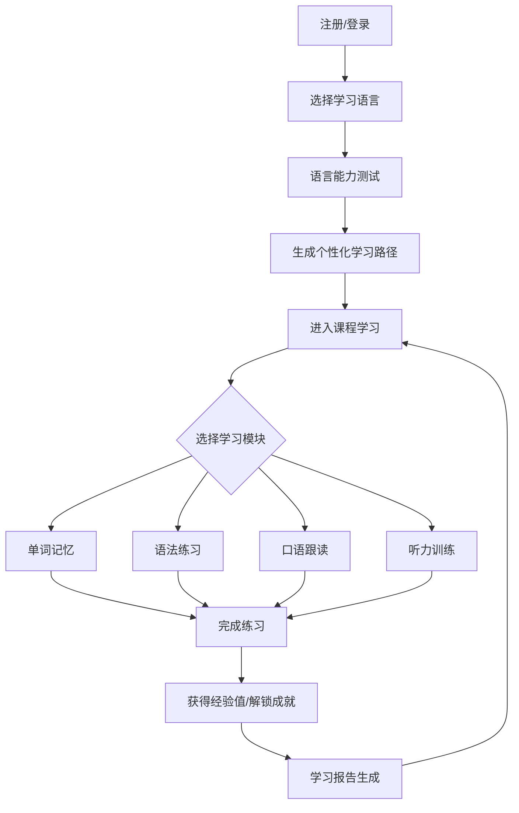
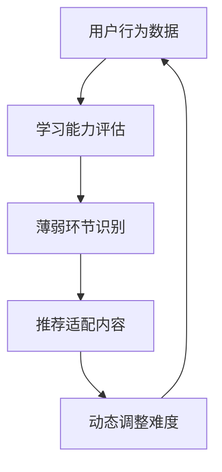

# 多语种在线教育平台 - 产品需求文档

## 1. 产品概述

**产品名称**: LinguaFlow 沉浸式多语种学习平台

**项目概述**: 一款支持英语、日语、韩语等主流语言的沉浸式在线语言学习平台，通过分级课程体系、互动学习模块和个性化路径推荐，为用户打造高效、有趣的语言学习体验。

**目标用户**:
- 有外语学习需求的在校学生
- 想要提升职业技能的职场人士
- 语言爱好者及出国移民群体

**市场价值**: 融合游戏化元素与专业教学体系，打造差异化竞争壁垒。

---

## 2. 核心功能

### 2.1 用户角色

| 角色 | 注册方式 | 核心权限 |
|------|----------|----------|
| 游客 | - | 浏览公开课程、查看排行榜 |
| 注册用户 | 邮箱/手机号注册 | 完整学习功能、进度追踪、社区互动 |
| VIP用户 | 付费升级 | 高级课程、AI口语辅导、一对一指导 |

### 2.2 功能模块

1. **首页/仪表盘** - 学习概览、推荐课程、每日任务、 streak 连续学习提醒
2. **课程中心** - 分级课程浏览、语言切换、学习路径选择
3. **互动学习模块** - 单词记忆、语法练习、口语跟读、听力训练
4. **学习进度** - 个人数据统计、能力雷达图、进度时间线
5. **社区中心** - 学习小组、话题讨论、学习笔记分享
6. **成就中心** - 徽章系统、排行榜、里程碑奖励
7. **个人中心** - 账户管理、学习设置、VIP升级

---

## 3. 核心流程

### 3.1 用户学习流程

### 3.2 个性化推荐流程

---

## 4. 用户界面设计

### 4.1 设计风格

**设计理念**: 现代极简 + 温暖亲和力

**配色方案**:
- 主色调: `#6366F1` (靛蓝紫 - 代表智慧与信任)
- 次要色: `#10B981` (翡翠绿 - 代表成长与进步)
- 强调色: `#F59E0B` (琥珀橙 - 代表活力与成就)
- 背景色: `#F8FAFC` (雪白) / `#1E293B` (深夜蓝 - 暗色模式)
- 文字色: `#1E293B` (主文字) / `#64748B` (次要文字)

**字体选择**:
- 标题: `"Outfit", sans-serif` - 现代几何感
- 正文: `"Inter", system-ui` - 清晰可读
- 中日韩字符: `"Noto Sans SC", "Noto Sans JP", "Noto Sans KR"`

**按钮风格**: 圆角卡片式按钮 (border-radius: 12px)，悬停时带微妙上浮动画

**布局风格**: 左侧导航栏 + 右侧内容区，卡片式内容展示

**图标风格**: Lucide Icons，圆润线性风格

### 4.2 页面设计

| 页面名称 | 模块名称 | UI元素描述 |
|----------|----------|------------|
| 首页仪表盘 | 学习概览卡片 | 圆形进度环、streak 日历、热力图 |
| 课程中心 | 课程卡片网格 | 悬停时显示课程详情浮层、语言标签 |
| 单词记忆 | 记忆卡片翻转 | 3D翻转动画、进度条、记忆曲线图 |
| 语法练习 | 填空/选择交互 | 即时反馈动画、错误解析、详解面板 |
| 口语跟读 | 录音波形动画 | 麦克风动画、波形可视化、AI评分 |
| 听力训练 | 音频播放控制 | 播放速度调节、循环段落、听写模式 |
| 学习进度 | 雷达图/折线图 | 能力维度可视化、趋势动画 |
| 社区中心 | 动态卡片列表 | 用户头像、点赞动画、评论气泡 |
| 成就中心 | 徽章展示墙 | 3D徽章效果、解锁动画、稀有度光效 |

### 4.3 响应式策略

- **桌面端** (≥1024px): 左侧固定导航栏 + 多列内容区
- **平板端** (768-1023px): 可折叠侧边栏 + 两列网格
- **移动端** (<768px): 底部导航栏 + 单列流式布局

### 4.4 动效设计

- **页面切换**: 淡入淡出 + 轻微位移 (300ms ease-out)
- **卡片悬停**: 上浮 4px + 阴影加深
- **进度更新**: 数字滚动动画
- **成就解锁**: 粒子爆发 + 徽章旋转动画
- **音频波形**: 实时频率响应动画

---

## 5. 性能目标

- 首屏加载时间 < 2秒
- 页面切换动画流畅 (60fps)
- 音频播放无卡顿
- 离线缓存支持学习内容
