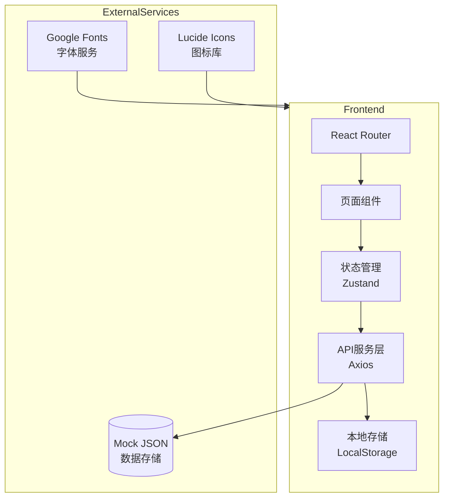

# 多语种在线教育平台 - 技术架构文档

## 1. 架构设计



**说明**: 本项目为前端单页应用，使用 Mock JSON 数据模拟后端 API，支持本地存储实现用户数据持久化。

---

## 2. 技术选型

| 层级 | 技术栈 | 版本 |
|------|--------|------|
| 框架 | React | 18.x |
| 构建工具 | Vite | 5.x |
| 样式方案 | Tailwind CSS | 3.x |
| 状态管理 | Zustand | 4.x |
| 路由管理 | React Router DOM | 6.x |
| 图标库 | Lucide React | 最新 |
| 动画库 | Framer Motion | 11.x |
| 图表库 | Recharts | 2.x |
| 音频处理 | Web Audio API | - |

---

## 3. 路由定义

| 路由 | 页面名称 | 权限要求 |
|------|----------|----------|
| `/` | 首页仪表盘 | 需登录 |
| `/courses` | 课程中心 | 需登录 |
| `/learn/:moduleId` | 互动学习模块 | 需登录 |
| `/progress` | 学习进度 | 需登录 |
| `/community` | 社区中心 | 需登录 |
| `/achievements` | 成就中心 | 需登录 |
| `/profile` | 个人中心 | 需登录 |
| `/login` | 登录页 | 公开 |
| `/register` | 注册页 | 公开 |

---

## 4. 数据模型

### 4.1 用户数据

```typescript
interface User {
  id: string;
  email: string;
  nickname: string;
  avatar: string;
  targetLanguage: 'en' | 'ja' | 'ko';
  level: number;
  xp: number;
  streak: number;
  vip: boolean;
  joinedAt: string;
}
```

### 4.2 课程数据

```typescript
interface Course {
  id: string;
  language: 'en' | 'ja' | 'ko';
  level: 'beginner' | 'intermediate' | 'advanced';
  title: string;
  description: string;
  lessons: Lesson[];
  xpReward: number;
}

interface Lesson {
  id: string;
  title: string;
  type: 'vocabulary' | 'grammar' | 'speaking' | 'listening';
  content: LessonContent;
  duration: number; // 分钟
}
```

### 4.3 学习进度

```typescript
interface LearningProgress {
  userId: string;
  courseId: string;
  completedLessons: string[];
  quizScores: Record<string, number>;
  lastStudyDate: string;
  totalStudyTime: number;
}
```

### 4.4 成就数据

```typescript
interface Achievement {
  id: string;
  title: string;
  description: string;
  icon: string;
  rarity: 'common' | 'rare' | 'epic' | 'legendary';
  unlockCriteria: string;
  xpReward: number;
}
```

---

## 5. 组件架构

```
src/
├── components/
│   ├── layout/
│   │   ├── Sidebar.tsx       # 侧边导航栏
│   │   ├── Header.tsx        # 顶部栏
│   │   └── BottomNav.tsx      # 移动端底部导航
│   ├── common/
│   │   ├── Button.tsx
│   │   ├── Card.tsx
│   │   ├── ProgressRing.tsx   # 环形进度
│   │   ├── Modal.tsx
│   │   └── Toast.tsx
│   ├── learning/
│   │   ├── FlashCard.tsx      # 单词翻转卡片
│   │   ├── QuizQuestion.tsx   # 测验题目
│   │   ├── AudioRecorder.tsx  # 录音组件
│   │   └── Waveform.tsx       # 音频波形
│   ├── course/
│   │   ├── CourseCard.tsx
│   │   ├── LessonItem.tsx
│   │   └── LanguageSwitcher.tsx
│   └── achievement/
│       ├── Badge.tsx
│       └── Leaderboard.tsx
├── pages/
│   ├── Dashboard.tsx
│   ├── Courses.tsx
│   ├── Learning.tsx
│   ├── Progress.tsx
│   ├── Community.tsx
│   ├── Achievements.tsx
│   ├── Profile.tsx
│   ├── Login.tsx
│   └── Register.tsx
├── stores/
│   ├── authStore.ts           # 认证状态
│   ├── courseStore.ts         # 课程数据
│   ├── progressStore.ts        # 学习进度
│   └── achievementStore.ts     # 成就数据
├── hooks/
│   ├── useAudio.ts
│   ├── useLocalStorage.ts
│   └── useProgress.ts
├── data/
│   └── mockData.ts            # 模拟数据
├── styles/
│   └── index.css
└── App.tsx
```

---

## 6. Mock 数据策略

- 使用 `localStorage` 存储用户注册信息和学习进度
- 课程数据内置于 `mockData.ts`
- 成就解锁状态实时计算并缓存
- 社区动态使用静态模拟数据

---

## 7. 关键实现细节

### 7.1 认证流程
- 邮箱格式验证 + 密码强度检查
- JWT Token 模拟存储于 localStorage
- 路由守卫验证登录状态

### 7.2 音频录制
- 使用 Web Audio API 获取麦克风输入
- 实时波形可视化
- 录音时长限制 30 秒

### 7.3 学习进度计算
- XP 经验值体系: 完成课程 +100XP, 每日登录 +10XP, streak 奖励
- 能力雷达图: 词汇量、语法、口语、听力四个维度

### 7.4 成就解锁
- 基于用户行为事件触发检查
- 本地缓存已解锁成就 ID 列表
- 稀有度决定徽章视觉效果
